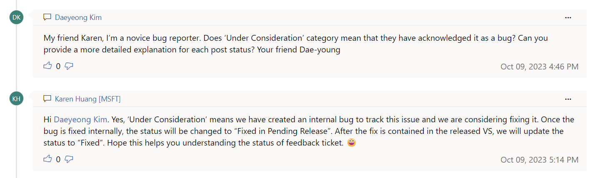

# 컴파일러 최적화 버그 제보
# List of Compiler Optimization Bugs Reported by BoBpiler Team

이 문서는 BoBpiler 팀이 [BoBpiler 퍼저](https://github.com/BoBpiler/BoBpiler-Fuzzer)를 사용하여 발견하고 보고한 다양한 컴파일러의 최적화 버그들을 모아놓은 목록입니다. 각 컴파일러, 아키텍처, 버그 유형 및 상세 링크를 포함하고 있습니다. 이러한 버그 리포트는 해당 분야의 전문가들이 문제를 해결하고 소프트웨어 개발 과정에서 발생할 수 있는 유사한 문제와 잠재적인 보안 취약점을 예방하는 데 기여할 수 있습니다.

This document contains a compilation of various compiler optimization bugs discovered and reported by the BoBpiler Team using the [BoBpiler Fuzzer](https://github.com/BoBpiler/BoBpiler-Fuzzer). It includes the compiler, architecture, type of bug, and a link to further details. Each bug report can assist experts in resolving issues, thereby helping to prevent similar issues and potential security vulnerabilities in the software development process.

**컴파일러 버그 취약점 PoC 및 스텔스 백도어 시나리오:**

현재 문서에 정리된 보고한 버그들을 기반으로 취약점 PoC(Proof of Concepts)와 스텔스 백도어 시나리오를 개발하였습니다. 이 레포지토리, [컴파일러 버그 취약점 PoC 및 스텔스 백도어 시나리오](https://github.com/BoBpiler/compiler-bug-vulnerability), 에서는 컴파일러 최적화 버그들을 어떻게 소프트웨어 내 취약점 및 스텔스 백도어로 활용할 수 있는지에 대한 연구를 상세히 다루고 있습니다.

**Compiler Bug Vulnerable PoCs and Stealth Backdoor Scenarios:** 

The bugs reported in this document have been further explored to develop Proof of Concepts (PoCs) and stealth backdoor scenarios. This repository, [Compiler Bug Vulnerable PoCs and Stealth Backdoor Scenarios](https://github.com/BoBpiler/compiler-bug-vulnerability), details the studies conducted on these reported bugs, demonstrating how they can be exploited to create vulnerabilities and stealth backdoors in software.

GCC 컴파일러 관련 버그는 Bugzilla에서, LLVM 컴파일러 관련 버그는 Git Issue에서 개발자들과 소통 중입니다. MSVC의 경우, **개발자들이 버그를 확인**하고, 상태를 'Under Consideration' 또는 'Under Investigation' 등으로 분류하여 **봇을 통해 공지합니다.**

Bugs related to the GCC compiler are being communicated with developers on Bugzilla, while those related to the LLVM compiler are discussed on Git Issues. For MSVC, developers acknowledge bugs and categorize their status as 'Under Consideration' or 'Under Investigation', which is then announced through bots.

## Explanation of Bug Status / 버그 상태 설명

| 시스템/플랫폼            | 상태 분류   | 태그                               | 상세 설명                                                                      |
|:-------------------------|:------------|:-----------------------------------|:-------------------------------------------------------------------------------|
| GCC Bugzilla             | Open        | New                                | 최근 보고된 새로운 버그 상태.                              |
| GCC Bugzilla             | Open        | WAITING                            | 버그 보고 후 검증 대기 중. 개발팀 또는 커뮤니티 확인 필요.  |
| GCC Bugzilla             | Open        | UNCONFIRMED                        | 버그 등록됐으나 아직 유효성 확인되지 않음. 'canconfirm' 권한을 가진 사람의 검증 필요. |
| GCC Bugzilla             | Open        | wrong-code                         | 컴파일러가 소스 코드를 잘못 해석하거나 잘못된 코드를 생성할 때 사용되는 태그.  |
| LLVM Git Issue           | Closed      | Fixed                              | 문제가 해결되어 이슈가 닫힌 상태. 버그 수정 완료.                              |
| LLVM Git Issue           | Open        | miscompilation                     | 컴파일러가 소스 코드의 컴파일을 잘못 처리하여 발생하는 오류를 지칭함.                                    |
| LLVM Git Issue           | Open        | llvm:optimizations                 | 최적화 관련 문제를 나타내는 태그. 컴파일러의 최적화 과정 중 발생하는 문제점을 다룸.                                              |
| MSVC Developer Community | Open        | Under Consideration(UC)            | 버그가 인지되었으며 수정 여부를 고려 중인 상태. 'UC'는 버그에 대한 수정 우선순위가 아직 결정되지 않았음을 나타냄.                                |
| MSVC Developer Community | Open        | Under Investigation(UI)            | 버그의 원인 및 해결 방안을 조사 중인 상태. 'UI'는 버그가 현재 조사 중이며 해결책이 명확하지 않음을 의미함.                                     |
| MSVC Developer Community | Closed      | Fixed                              | 문제가 해결되어 공식 버전에 포함된 상태. 'Fixed'는 버그가 완전히 해결되었고 추가 조치가 필요 없음을 의미함.                                       |

<h2>버그 상태 상세 설명</h2>

### GCC Bugzilla 버그 상태 설명: 

**WAITING**

- WAITING (대기 중): 버그가 보고되었지만, 아직 개발팀이나 커뮤니티에서 확인되지 않았습니다. 이 상태는 버그의 유효성 검증이 필요함을 의미합니다.

- WAITING: The bug has been reported but not yet verified by the development team or the community. This status indicates that validation of the bug's legitimacy is needed.

**UNCONFIRMED**

- UNCONFIRMED (미확인): 버그가 등록되었으나 아직 유효성이 확인되지 않은 상태입니다. 'canconfirm' 권한을 가진 사용자가 이 버그를 검증할 수 있습니다.

- UNCONFIRMED: The bug is registered but its validity has not yet been confirmed. Users with 'canconfirm' permissions can verify this bug.
- **S390x의 경우 GCC bugzilla에서 Waiting, Uncomfirmed를 받았지만, 동일한 케이스에 대해서 LLVM에서 버그로 인정받았습니다.**

**wrong-code keyword**

- wrong-code (잘못된 코드): 이 태그는 컴파일러가 소스 코드를 잘못 해석하거나 잘못된 코드를 생성하는 경우에 사용됩니다. 일반적으로 컴파일러의 오류나 최적화 문제로 인해 발생한 부정확한 연산 결과를 나타냅니다.

- wrong-code: This tag is used when the compiler misinterprets source code or generates incorrect code. It typically indicates inaccurate computation results due to errors or optimization issues in the compiler.

### LLVM Git Issue 태그 설명: 

**Open (태그명)**

- Open (태그명): LLVM에서 사용되는 다양한 태그는 버그의 특성이나 상태를 나타냅니다. 예를 들어, 'llvm:optimizations'는 최적화 관련 문제를, 'miscompilation'은 컴파일 오류를 지칭합니다.

- Open (Tag Name): Various tags used in LLVM indicate the nature or status of the bug. For example, 'llvm:optimizations' refers to optimization-related issues, while 'miscompilation' denotes compilation errors.

**Closed (Fixed)**

- Closed (Fixed) (해결됨): 버그가 해결되었거나 관련 이슈가 종료되었습니다. 'Fixed'는 버그에 대한 수정이 완료되었음을 의미합니다.

- Closed (Fixed): The bug has been resolved or the related issue has been closed. 'Fixed' indicates that the bug has been rectified and no further action is required.

### MSVC 버그 상태 설명: 

**[UC (Under Consideration)](https://developercommunity.visualstudio.com/t/Comparison-of-incorrect-register-values/10480763?sort=newest)**

- UC (고려 중): 이 상태는 MSVC 팀이 버그를 인지하고 내부적으로 등록했으며, 수정 여부를 고려 중임을 의미합니다. UC 상태는 문제가 확인되었으나 아직 구체적인 해결 방안이 결정되지 않았음을 나타냅니다.

- UC (Under Consideration): Indicates that the MSVC team is aware of the bug and it has been registered internally. The team is considering whether to fix it. The UC status means that the issue has been acknowledged, but a specific resolution has yet to be determined.

**UI (Under Investigation)**

- UI (조사 중): 버그가 현재 조사 중이며, 원인과 해결 방안을 파악하기 위한 단계에 있음을 의미합니다. 이 상태는 문제의 본질과 해결책이 아직 명확하지 않음을 나타냅니다.

- UI (Under Investigation): Indicates that the bug is currently being investigated, and the team is in the process of identifying the cause and potential solutions. This status signifies that the nature of the issue and its resolution are not yet clear.

**Fixed**

- Fixed (해결됨): 버그에 대한 수정이 완료되었으며, 해당 수정사항이 Visual Studio의 공식 발표된 버전에 포함되었음을 나타냅니다. 이 상태는 문제가 완전히 해결되었고, 추가적인 조치가 필요 없음을 의미합니다.

- Fixed: Indicates that the bug has been fixed and the fix is included in the officially released version of Visual Studio. This status means that the issue has been fully resolved and no further action is required.

---
## Reported Bug List / 버그 리스트
| Compiler | Arch | Bug Type | Status | Link |
| --- | --- | --------------------------- | ---- | ---- |
| ICX/ICPX | X86-64 |     Inaccurate Computation (부정확한 연산)    | Open | [Details](https://community.intel.com/t5/Intel-C-Compiler/Incorrect-results-in-optimization-levels-O3-and-Ofast-for-icpx/m-p/1552977#M41578) |
| ICX/ICPX | X86-64 |     Compiler Crash (크래시)    | Open | [Details](https://community.intel.com/t5/Intel-C-Compiler/Segmentation-Fault-in-optimization-levels-O3-and-Ofast-for-icpx/m-p/1553036#M41580) |
| GCC | Risc-V |     Inaccurate Computation (부정확한 연산)    | Open (New, needs-bisection, wrong-code) | [Details](https://gcc.gnu.org/bugzilla/show_bug.cgi?id=112758) |
| GCC | S390x |     Inaccurate Computation (부정확한 연산)    | Open (WAITING, wrong-code) | [Details](https://gcc.gnu.org/bugzilla/show_bug.cgi?id=112112) |
| GCC | S390x |     Inaccurate Computation (부정확한 연산)    | Open (UNCONFIRMED, 	wrong-code) | [Details](https://gcc.gnu.org/bugzilla/show_bug.cgi?id=112274) |
| GCC | S390x |     Inaccurate Computation (부정확한 연산)    | Open (UNCONFIRMED) | [Details](https://gcc.gnu.org/bugzilla/show_bug.cgi?id=112329) |
| GCC | S390x |     Inaccurate Computation (부정확한 연산)    | Open (UNCONFIRMED, 	wrong-code) | [Details](https://gcc.gnu.org/bugzilla/show_bug.cgi?id=112665) |
| GCC | S390x |     Inaccurate Computation (부정확한 연산)    | Open (UNCONFIRMED, 	wrong-code) | [Details](https://gcc.gnu.org/bugzilla/show_bug.cgi?id=112986) |
| GCC | S390x |     Inaccurate Computation (부정확한 연산)    | Open (UNCONFIRMED) | [Details](https://gcc.gnu.org/bugzilla/show_bug.cgi?id=112996) |
| LLVM | Arm64 |    Pointer Dereference Omission (포인터 역참조 생략)   | Open | [Details](https://github.com/llvm/llvm-project/issues/69294) |
| LLVM | Risc-v |    Sign/Unsign Extension Issue (부호 확장 문제)   | Closed (Fixed) | [Details](https://github.com/llvm/llvm-project/issues/68855) |
| LLVM | Powerpc64 |    Sign/Unsign Extension Issue (부호 확장 문제)   | Open (miscompilation) | [Details](https://github.com/llvm/llvm-project/issues/71030) |
| LLVM | Powerpc64 |    Inaccurate Computation (부정확한 연산)   | Open (miscompilation) | [Details](https://github.com/llvm/llvm-project/issues/74915) |
| LLVM | Mips64el |     Inaccurate Computation (부정확한 연산)    | Open (llvm:optimizations) | [Details](https://github.com/llvm/llvm-project/issues/69328) |
| LLVM | Mips64 |   Inaccurate Computation (부정확한 연산)    | Open (miscompilation, llvm:optimizations)| [Details](https://github.com/llvm/llvm-project/issues/70495) |
| LLVM | S390x |    Inaccurate Computation (부정확한 연산)    | Open (miscompilation) | [Details](https://github.com/llvm/llvm-project/issues/72018) |
| MSVC | Arm64 |    Inaccurate Computation (부정확한 연산)    | UC | [Details](https://developercommunity.visualstudio.com/t/C-ARM64-Optimization-Bug/10503910) |
| MSVC | Arm64 |    Inaccurate Computation (부정확한 연산)    | UC | [Details](https://developercommunity.visualstudio.com/t/Inconsistent-Outputs-in-ARM64-C-Progra/10505191) |
| MSVC | Arm64 |    Inaccurate Computation (부정확한 연산)    | UC | [Details](https://developercommunity.visualstudio.com/t/ARM64-MSVC-Compiler-Optimization-Leads-t/10508262) |
| MSVC | Arm64 |    Inaccurate Computation (부정확한 연산)    | UC | [Details](https://developercommunity.visualstudio.com/t/MSVC-ARM64-Compiler-Incorrectly-Optimize/10510611) |
| MSVC | Arm64 |    Inaccurate Computation (부정확한 연산)    | UC | [Details](https://developercommunity.visualstudio.com/t/Inconsistent-Comparison-Results-of-Unsig/10521901) |
| MSVC | X86-64 |   Incorrect Inline Call Order (부정확한 인라인 호출 순서)    | UC | [Details](https://developercommunity.visualstudio.com/t/O1-Optimization-Leads-to-Incorrect-Funct/10469220?sort=newest) |
| MSVC | X86-64 |   Misidentification of Different Variable Addresses (다른 변수 주소 동일 인식)     | UC | [Details](https://developercommunity.visualstudio.com/t/Memory-reference-error-due-to-excessive/10477735?sort=newest&page=1) |
| MSVC | X86-64 |   Infinite Loop Elimination (무한 루프 제거)   | UC | [Details](https://developercommunity.visualstudio.com/t/Optimization-Levels-O1-O2-Ox-Incorrect/10478781?sort=newest) |
| MSVC | X86-64 |   Inaccurate Calculation and Comparison of Constants (상수의 부정확한 계산 및 비교)     | UC | [Details](https://developercommunity.visualstudio.com/t/Incorrectly-compiled-comparison-and-cons/10480723?sort=newest) |
| MSVC | X86-64 |   Non-Compliance with C Standard for Hexadecimal Literal Constants (16진수 상수 리터럴 c 표준 미준수)     | UC | [Details](https://developercommunity.visualstudio.com/t/cl-Compiler-Misinterprets-Hexadecimal-Li/10483175) |
| MSVC | X86-64 |   Omission of Stack Initialization for Local Variables (지역 변수의 스택 초기화 누락)     | UC | [Details](https://developercommunity.visualstudio.com/t/Function-pointer-address-comparison-erro/10485960?sort=newest) |
| MSVC | X86-64 |   Compiler Crash (크래시)   | UC | [Details](https://developercommunity.visualstudio.com/t/Internal-Compiler-Error-with-for-loop-an/10486573) |
| MSVC | X86-64 |   Compiler Crash (크래시)   | UC | [Details](https://developercommunity.visualstudio.com/t/fatal-error-C1001:-Internal-Compiler-Err/10485991?sort=newest) |
| MSVC | X86-64 |   Sign/Unsign Extension Issue (부호 확장 문제)   | UI | [Details](https://developercommunity.visualstudio.com/t/Signed-variable-value-extended-in-an-uns/10478879?sort=newest&q=Signed+variable+value+extended+in+an+unsigned+manner&page=3) |
| MSVC | X86-64 |   Sign/Unsign Extension Issue (부호 확장 문제)   | UC | [Details](https://developercommunity.visualstudio.com/t/Incorrect-unsigned-extension-when-upcast/10481317?sort=newest) |
| MSVC | X86-64 | Sign/Unsign Extension Issue (부호 확장 문제) | UC | [Details](https://developercommunity.visualstudio.com/t/Impact-of-printf-on-CL-Compiler-Optimiza/10481033?sort=newest) |
| MSVC | Arm64 |    Sign/Unsign Extension Issue (부호 확장 문제)   | UC | [Details](https://developercommunity.visualstudio.com/t/Incorrect-Assembly-Code-Generated-with-/10506096) |
| MSVC | X86-64 |   Inaccurate Computation (부정확한 연산)    | UC | [Details](https://developercommunity.visualstudio.com/t/O2-and-Ox-Optimizations-Result-in-Incorr/10476654?sort=newest) |
| MSVC | X86-64 |   Inaccurate Computation (부정확한 연산)    | UC | [Details](https://developercommunity.visualstudio.com/t/Integer-overflow-due-to-optimization-in/10478835?sort=newest) |
| MSVC | X86-64 |   Inaccurate Computation (부정확한 연산)    | UC | [Details](https://developercommunity.visualstudio.com/t/Comparison-of-incorrect-register-values/10480763?sort=newest) |
| MSVC | X86-64 |   Inaccurate Computation (부정확한 연산)    | UC | [Details](https://developercommunity.visualstudio.com/t/It-optimizes-the-and-operation-into-x/10481313) |
| MSVC | X86-64 |   Inaccurate Computation (부정확한 연산)    | Fixed | [Details](https://developercommunity.visualstudio.com/t/Compiler-bug-causing-unknown-behavior/10481332?sort=newest) |
